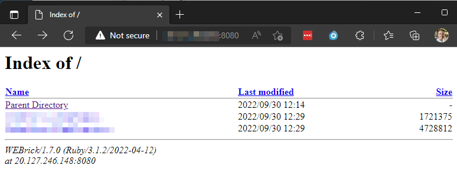

# azureStackEdgeCompute

Solutions that support Edge compute scenarios

## LAN Browser Access to Storage Account Folders and Files

Storage Accounts only provide direct access to single files. Edge compute scenarios may require remote users to access folder structure and files to quickly disseminate information and data.

### Deployment Instructions

1. Create a Storage Account in Azure Cloud
2. Pin storage account to Azure Stack Edge
3. Validate storage is synced between Azure Stack Edge device and Azure Cloud
4. Create VM running Ubuntu on Azure Stack Edge
5. Copy Bash commands in [Ubuntu-Bash-InstallAndStart_HTTP_Host_FilesAndFolders.sh](./Ubuntu-Bash-InstallAndStart_HTTP_Host_FilesAndFolders.sh) 
6. Replace the following values appropriately 

     ```bash
     echo accountName REPLACE_WITH_STORAGE_ACCOUNT_NAME >> fuse_connection.cfg
     echo accountKey REPLACE_WITH_STORAGE_ACCOUNT_KEY >> fuse_connection.cfg
     echo containerName REPLACE_WITH_CONTAINER_NAME >> fuse_connection.cfg
     ```

7. Replace all 5 locations of `uniqueName`, including `uniqueNameWebHost`, with a unique name for the purpose of your solution

8. Copy and paste each commented section into Bash on the VM running on the Azure Stack Edge device

   1. You CANNOT copy ALL of the code and paste it, Bash doesn't manage sequential execution well.

   2. Example 

      1. Copy the block and paste it

         ~~~bash
         # install BlobFuse
           wget https://packages.microsoft.com/config/ubuntu/20.04/packages-microsoft-prod.deb
           sudo dpkg -i packages-microsoft-prod.deb
           sudo apt-get update -y 
           sudo apt-get install  -y blobfuse
         ~~~
         
      2. When the previous block of code completes, copy the next block and paste it
      
         ~~~bash
         # create Fuse Connection
           touch fuse_connection.cfg
           echo accountName REPLACE_WITH_STORAGE_ACCOUNT_NAME >> fuse_connection.cfg
           # Use Key 1
           echo accountKey REPLACE_WITH_STORAGE_ACCOUNT_KEY >> fuse_connection.cfg
           echo containerName REPLACE_WITH_CONTAINER_NAME >> fuse_connection.cfg
           chmod 600 fuse_connection.cfg
         ~~~
   
9. Using a browser on a device that can access the LAN IP address of the VM, visit http://LAN_IP:8080

   

### Video

Video TBD