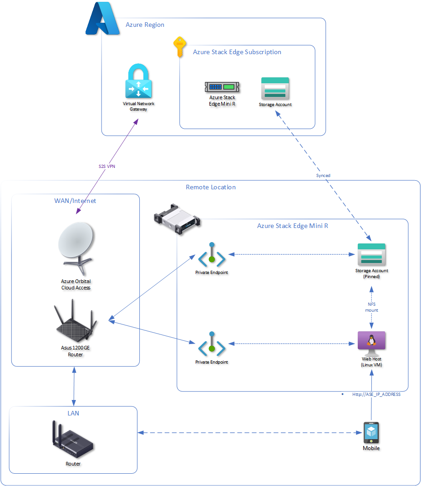

# Azure Stack Edge Compute Solutions

Solutions that support Edge compute scenarios

## LAN Browser Access to Storage Account Folders and Files

Storage Accounts only provide direct access to single files. Edge compute scenarios may require remote users to access folder structure and files to quickly disseminate information and data.

### Deployment Instructions

1. Create storage account and sync it to the Azure Stack Edge.

   1. This is used to sync the VM image (.vhd) to the Azure Stack Edge.
   2. Follow the Microsoft Learn guide [Tutorial to transfer data to storage account with Azure Stack Edge Pro GPU | Microsoft Learn](https://learn.microsoft.com/en-us/azure/databox-online/azure-stack-edge-gpu-deploy-add-storage-accounts).
2. Create NFS share and sync it to Azure Stack Edge.

   1. Follow the Microsoft Learn guide [Tutorial to transfer data to shares with Azure Stack Edge Pro GPU | Microsoft Learn](https://learn.microsoft.com/en-us/azure/databox-online/azure-stack-edge-gpu-deploy-add-shares).
3. Validate storage is synced between Azure Stack Edge device and Azure Cloud.
   1. Copy files into the the share in Azure cloud and validate they show up on the Azure Stack Edge.
4. Create VHD and copy it to storage account on the Azure Stack Edge

   1. Use the Azure PowerShell commands in [Ubuntu.ps1](./Ubuntu.ps1) to create a vhd from a managed disk using a Ubuntu image from the Azure marketplace.
5. Create VM running Ubuntu on Azure Stack Edge.

   1. Follow the Microsoft Learn guide [Deploy VMs on your Azure Stack Edge Pro GPU via the Azure portal | Microsoft Learn](https://learn.microsoft.com/en-us/azure/databox-online/azure-stack-edge-gpu-deploy-virtual-machine-portal#add-a-vm).
6. Configure the VM

   1. Use a computer connected locally to the Azure Stack Edge
   2. Copy Bash commands in [Ubuntu-Bash-InstallAndStart_HTTP_Host_FilesAndFolders.sh](./Ubuntu-Bash-InstallAndStart_HTTP_Host_FilesAndFolders.sh).
   3. Replace all locations of `uniqueName` with a unique name for the purpose of your solution.
   4. Replace `ASE_IP_ADDRESS` with the IP Address of the Azure Stack Edge.
      1. There are four ports, it is important to select the IP address of the port that has "compute" enabled.
   5. Copy and paste each line one by one into Bash on the VM running on the Azure Stack Edge device.
      1. You CANNOT copy ALL of the code and paste it, Bash doesn't manage sequential execution well.
7. Access the files and folders on the NFS share from a browser

   1. Using a browser on a device that can access the LAN IP address of the VM, visit `http://ASE_IP_ADDRESS:8080`.

   